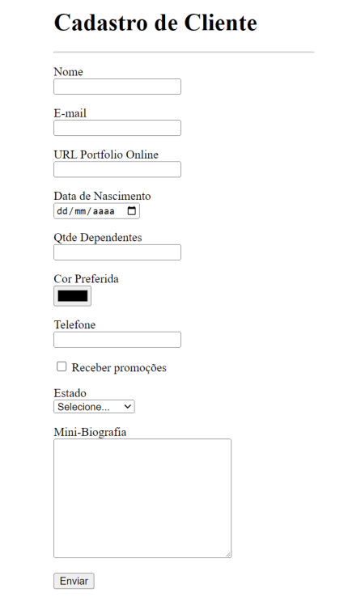

# Práticas Sugeridas da Aula 10

## Instruções

1. O formulário HTML mostrado na figura a seguir contém 10 tipos diferentes de campos de entrada de
dados. Faça o código HTML desse formulário, considerando que ele deve ser enviado para o endereço
“/cliente/cadastrar”.

