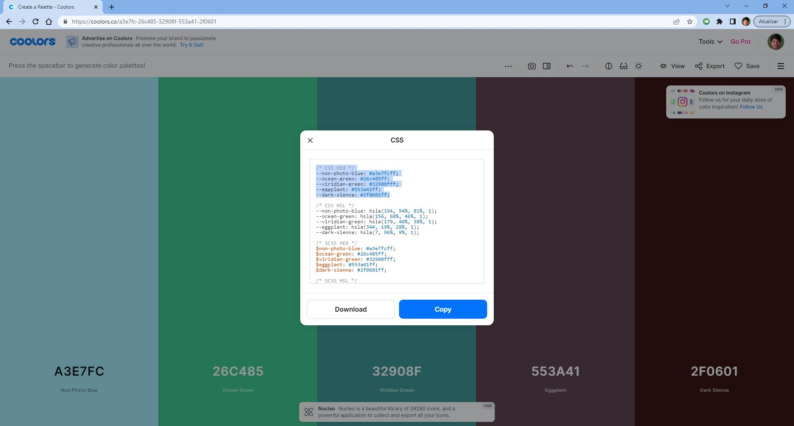
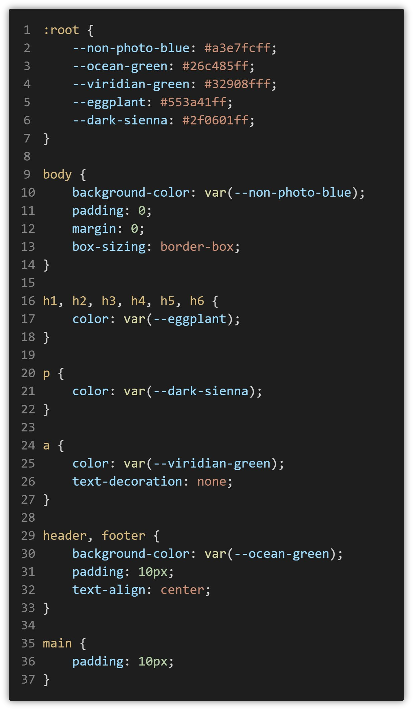
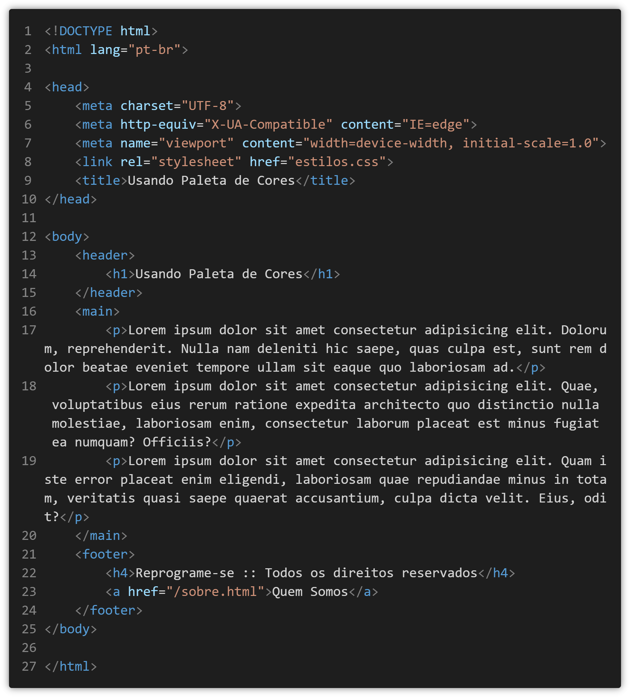

# Práticas Sugeridas da Aula 12

## Instruções

1. Uma habilidade muito importante para um web designer é a seleção de cores para se usar como tema de um site. Entretanto, web designers iniciantes tendem a utilizar combinações de cores que nem sempre são favoráveis a uma boa apresentação. Existem algumas ferramentas online que são capazes de gerar paletas de cores que se harmonizam entre si. Por exemplo, o site https://coolors.co tem esse foco. Essa prática vai utilizar esse site. Portanto, entre no site e clique no botão azul intitulado “Start the generator!” para criar sua paleta de cores. Assim que a paleta de cores se abrir, pressione a barra de espaços para gerar uma nova paleta, até que encontre uma que lhe satisfaça. Quando encontrar a paleta desejada, clique no link “Export” na barra de navegação superior. Veja que uma janela é aberta com várias opções de exportação da paleta.

Dica: outros dois sites que podem te ajudar a gerar paletas de cores são: 
- a) https://color.adobe.com/pt/create/color-wheel 
- b) https://paletadecores.com/ 

2.	Na prática anterior, você gerou uma paleta de cores. Agora você vai gerar um novo arquivo CSS com essa paleta de cores. Primeiro, clique no link “Export” e em seguida clique em CSS. Agora selecione o primeiro trecho com os valores de cores hexadecimais (conforme figura anterior) e dê um Ctrl + C para copiar. Em seguida, em uma nova pasta, crie um arquivo CSS chamado “estilos.css” e cole esse código copiado dentro de um seletor “:root”, conforme a figura a seguir. Pronto! Agora você já pode usar essa paleta de cores em seus estilos CSS. e transferiu o código CSS para um novo arquivo CSS. Agora complemente o arquivo CSS com o restante do código mostrado na figura.

Esse exemplo mostra o uso de variáveis CSS. É uma excelente forma de se utilizar paletas de cores, uma vez que permite concentrar as cores selecionadas em apenas um local do arquivo CSS. Caso seja necessário mudar uma cor, a alteração deverá ser feita em apenas um local, facilitando a manutenção.

3.	Agora vamos criar um uma página HTML para vincular esse arquivo CSS e conferir o resultado gerado. Crie uma página HTML conforme a figura a seguir e veja o resultado da renderização. Dica: digite “lorem30” e pressione TAB para gerar os textos dos parágrafos.

4. Complemente essa página adicionando uma textura de plano de fundo a seu gosto e bordas horizontais
no cabeçalho e no rodapé utilizando cores da paleta. Dica: o site https://www.transparenttextures.com
pode te ajudar a gerar planos de fundo bem interessantes.