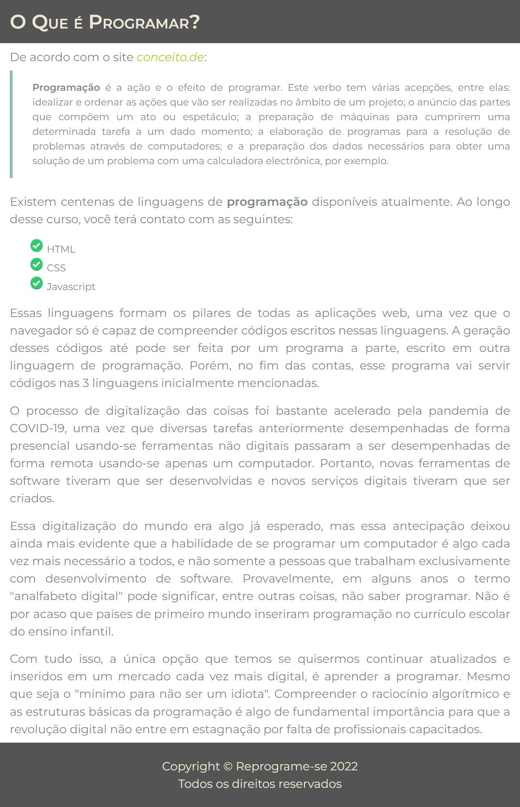

# Práticas Sugeridas da Aula 13

## Instruções

1. Usando HTML e CSS, crie uma página conforme a figura a seguir. 

Dicas: 
- a) A fonte usada é a Monserrat, obtida no Google Fonts; 
- b) O ícone de item de lista foi obtido em https://freeicons.io, buscando-se pelo termo “check list”. 
