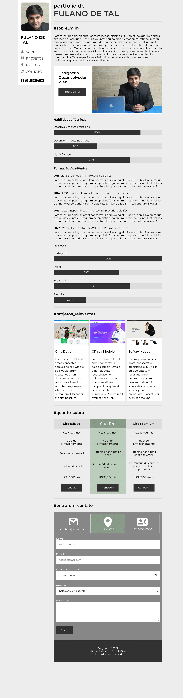
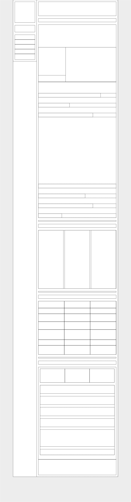

# Atividade Prática da Semana 3

## Instruções

Na semana anterior, você fez um site de portfólio com 4 páginas usando leiaute baseado em tabelas. Agora que você avançou ainda mais nos estudos de CSS, você terá a oportunidade de criar um site de portfólio totalmente novo usando o leiaute tableless (sem tabelas) e com um design muito mais moderno e sofisticado. As duas últimas páginas deste documento apresentam, respectivamente, o leiaute aramado do site a ser construído e a versão final do site.

Este novo site tem uma peculiaridade interessante, que é o fato de ele ser composto por uma única página. Esse estilo de site, chamado de single page, tornou-se muito popular nos últimos anos. Ele é particularmente interessante quando você deseja guiar o foco do usuário gradativamente para uma ação final, como a realização de uma compra, por exemplo. Você já deve ter clicado em algum link que te levou para um site desse tipo, em que você se depara com algum produto ou serviço aparentemente atraente e na medida em que vai rolando a página, são mostradas características, vantagens, depoimentos e mais uma série de coisas que te conduzem ao “gran finale”, que é a compra de algo.

Nesta nova versão do site de portfólio, eu acrescentei uma seção de preços de serviços de criação de sites. O intuito do site é de guiar o foco do usuário para que ele adquira um dos planos de criação de sites oferecidos pelo dono do portfólio. Como se trata de um exemplo fictício, ignore a capacidade de persuasão do site e foque somente nos elementos construtivos.

Portanto, vamos à tarefa. Com base nas informações visuais das figuras apresentadas nas duas últimas páginas, você deve recriar o site de portfólio para que ele fique visualmente o mais próximo possível do que é apresentado na figura da última página. As imagens utilizadas na criação do site podem ser baixadas junto ao enunciado da questão em nossa sala virtual. Agora vamos às indispensáveis dicas para que você consiga evoluir na realização dessa atividade:

1) A fonte usada foi a Montserrat, que pode ser obtida no site Google Fonts.
2) A barra de navegação à esquerda, que contém uma foto pequena do dono do portfólio, deve ser fixa, ou seja, enquanto o conteúdo à direita rola, a barra de navegação fica imóvel. A propriedade CSS display permite configurar isso.
3) Para definir os tamanhos dos elementos, considere uma largura de tela de 1280px. A página ocupa 80% dessa largura e os outros 20% são distribuídos nas laterais, de forma que o conteúdo fique centralizado.
4) Utilize as unidades de medida vw e/ou vh para que as dimensões das regiões, fontes e imagens se baseiem na largura e na altura da região de visualização da página.
5) O menu lateral fixo tem 100vh de altura e 18vw de largura.
6) A região que acomoda o conteúdo, à direita, tem 62vw de largura e tem margem esquerda de 18vw.
7) As linhas divisórias entre as seções são elementos HR estilizados com uma cor de fundo sólida e sem bordas.
8) Pode ser necessário usar o termo !important; ao fim de algumas propriedades CSS para sobrescrever valores de
seletores conflitantes.
9) As barras de progresso desse site NÃO USAM o elemento &lt;progress&gt;. Na verdade, cada barra de progresso usada aqui deve ser criada usando um elemento &lt;div&gt; dentro de outro &lt;div&gt;. Neste caso, o elemento &lt;div&gt; “pai” é o fundo claro e o elemento &lt;div&gt; “filho” é a barra de percentual. Elas devem ser configuradas com a mesma altura.
10) A seção dos projetos pode ser feita com uma tabela de 3 colunas, sendo uma para cada projeto.
11) A seção de preços dos serviços pode ser feita com uma tabela de 3 colunas por 7 linhas.
12) Na seção de contatos, a primeira linha contendo 3 retângulos pode ser feita com uma tabela. Já no caso do formulário, use um elemento &lt;div&gt; para envolver cada conjunto &lt;label&gt;...&lt;input&gt; (ou outro tipo de campo).
13) A região do rodapé pode ser criada com um elemento &lt;div&gt;.
14) Junto com os arquivos de imagens disponíveis para download, há um arquivo CSS com utilitários para margens, cores e outras configurações gerais. Ele pode facilitar em várias situações, portanto, não deixe de usá-lo.
    
Agora que você já leu as dicas, abra o editor de código e mãos à obra!

