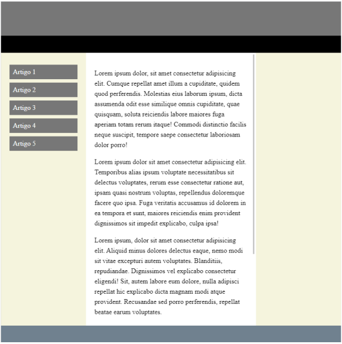

# Práticas Sugeridas da Aula 17

## Instruções

1. Crie uma página semelhante à da figura a seguir. Observe que a região central possui uma barra de
rolagem própria, independentemente do restante da página. Faça uso das propriedades CSS float e
overflow sempre que possível.

