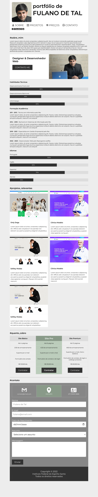
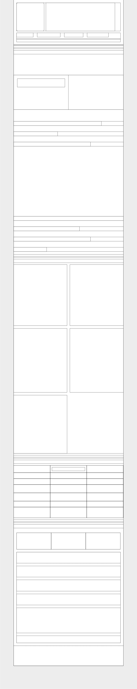

# Atividade Prática da Semana 4

## Instruções

Na semana anterior, você fez um site de portfólio moderno e sofisticado no estilo single page. Apesar de o site proposto na atividade ser digno de publicação, ele tem um problema relevante para os dias atuais, que é o fato de ele não ser responsivo. Isso quer dizer que ele não é capaz de adequar seu leiaute a diferentes resoluções de tela. A versão proposta na atividade é adequada para telas de tamanho grande, como telas de computadores e tablets na posição horizontal. Em um celular na posição vertical, por exemplo, o site não abrirá de forma dequada, provavelmente causando um abandono prematuro por parte usuário.

Na atividade dessa semana, a última desse módulo, o seu objetivo vai ser aprimorar o leiaute do site desenvolvido na semana anterior de forma que ele se torne responsivo. Além disso, você deverá fazer uso de leiaute baseado em CSS Flexbox e em CSS Grid, apresentados ao longo dessa semana. O projeto do site pronto da semana 3 está disponível para download junto à página da atividade no ambiente virtual de aprendizagem. Agora vamos à descrição da tarefa.

Com base nas informações visuais das figuras apresentadas nas seis últimas páginas, você deve recriar o site de portfólio para que ele fique visualmente o mais próximo possível do que é apresentado nas figuras, focando na responsividade e no leiaute baseado em flexbox e grid. Em síntese, o que deve mudar são apenas as configurações de leiaute visando alcançar a esponsividade e os códigos que adicionam a responsividade em si.

A página 2 desse documento mostra uma captura de tela do site a ser construído já em sua versão responsiva em uma tela estreita. Na página 3, você pode ver como devem estar dispostas as regiões que compõem a versão responsiva. Agora vamos às dicas imprescindíveis para que você consiga evoluir na realização dessa atividade:

1) O menu fixo permanece com a mesma configuração em telas largas. Contudo, em telas estreitas, o menu deixa de ter posicionamento fixo e passa a ficar no topo da página, ocupando toda a largura do contêiner. Isso quer dizer que seu posicionamento deve voltar a ser estático e sua largura deve passar para 80vw. A largura da região de conteúdo também deverá passar para 80vw.
2) Ainda em telas largas, a região de conteúdo, que é composta pelo cabeçalho, pelas seções #sobre_mim, #projetos_relevantes, #quanto_cobro, #contato e pelo rodapé, pode ser diagramada usando CSS grid ou flexbox, com um gap de 1.5rem para separar as seções (propriedade CSS gap).
3) No cabeçalho/menu para telas estreitas, o logotipo e o título podem ser colocados lado a lado se colocados em um contêiner flexbox. Os links de menu que conduzem às seções do site devem estar em outro contêiner flexbox, um ao lado do outro.
4) O texto “portifólio de” deve aparecer no menu e o texto “portifólio de Fulano de Tal” que aparece logo acima da seção “#sobre_mim” deve ser ocultado.
5) Na seção “#sobre_mim”, a hero section, que é o banner inicial com texto, botão e uma imagem à direita, pode ser diagramada com um grid CSS de uma linha e duas colunas. Vale ressaltar que as colunas requerem larguras diferentes para telas largas e telas estreitas, portanto, ao definir a propriedade grid-template-columns, atente-se para as frações atribuídas a cada coluna.
6) Na seção “#projetos_relevantes”, use um contêiner flexbox para agrupar os cards dos projetos e use a propriedade CSS gap para definir uma distância de 1.5rem entre os cards. O importante dessa seção é que, se eu adicionar um novo card ao contêiner, ele deve ocupar corretamente sua posição sem a necessidade de se fazer novas configurações CSS.
- Para definir a largura dos cards, use “width: calc(33.33% - 1rem);” se o gap for de 1.5rem e 3 cards por linha. Para 2 cards por linha, que é o padrão para telas estreitas, você deve definir a largura como “width:calc(50% - 0.75rem);”. Assim você conseguirá um alinhamento perfeito dos cards com as bordas da página.
7) Defina um limiar entre telas largas e telas estreitas. Eu adotei 1390px para um monitor full HD. Isso influência na definição do seletor de configuração responsiva. Exemplo:
- @media screen and (max-width: 1280px) { ... }

Agora que você já leu as dicas, chegou a hora de colocar a mão na massa! Bom trabalho!

