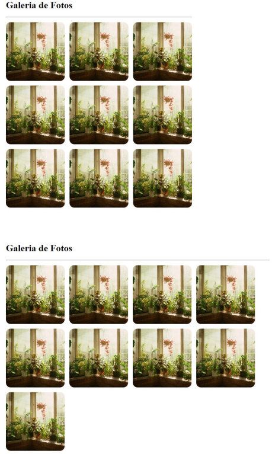

# Práticas Sugeridas da Aula 18

## Instruções

1. Crie uma galeria de fotos autoajustável à largura da página utilizando CSS Flexbox. Veja o exemplo nas figuras a seguir. A primeira figura mostra a galeria sendo exibida em uma tela de largura um pouco menor do que a da segunda figura. Dica: você consegue obter fotos para uso livre em https://www.pexels.com. 

